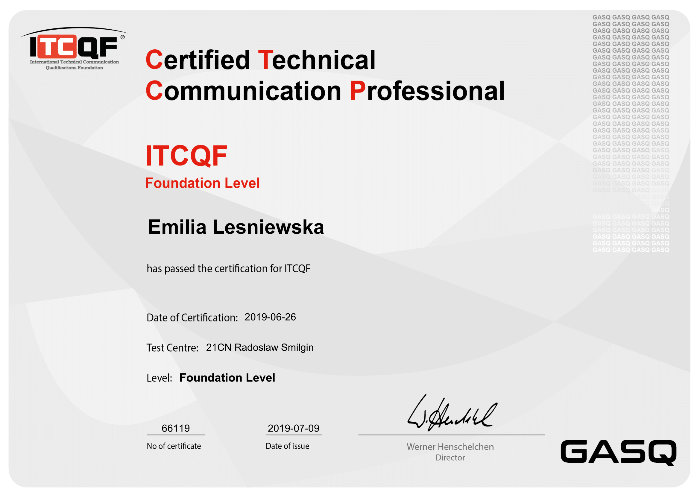

# My Certificates
## ITCQF Certified Technical Communications Foundation Level

## Certified SAFe® 5 Practitioner
Verify my digital badge here: https://www.credly.com/badges/1b9e065b-63be-401f-bad8-9c2a01fa9df2/linked_in_profile

## MadCap Flare 12 Essential Training

## Technical Writing: Quick Start Guides

## SQL for Non-Programmers

## Master the OWASP Top 10

## Learning the OWASP Top 10

